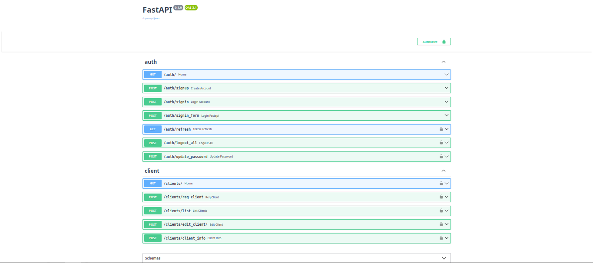

# FastAPI Auth API

## Description

Esse é um sistema simples de autenticação usando FastAPI

## Recursos

* Autenticação de Usuário
* Token JWT para autenticação
* hash de senha
* Rotas protegidas
* Banco SQLite
* Migrações de banco com Alembic

## Requisitos

* Python 3.x

## Instalação

1. Clone o repositório:

   ```
   git clone https://github.com/mrcode-sys/fastapi-auth-api.git
   cd fastapi-auth-api
   ```

2. Crie o ambiente virtual:

   ```
   python -m venv venv
   ```

3. Ative o ambiente virtual:

   Linux/Mac:

   ```
   source venv/bin/activate
   ```

   Windows:

   ```
   venv\Scripts\activate
   ```

4. Instale as dependencias:

   ```
   pip install -r requirements.txt
   ```

## Configuração

Crio o arquivo `.env` baseado no `.env.example`.

## Banco de dados

Execute as migrações para criar o banco de dados:

```
alembic upgrade head
```

## Executando o servidor

Inicie o servidor:

```
uvicorn app.main:app --reload
```

## API Documentation

Depois que o servidor estiver rodando acesse:

* Swagger UI: http://127.0.0.1:8000/docs
* ReDoc: http://127.0.0.1:8000/redoc

